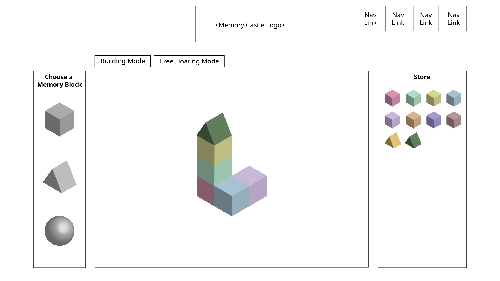
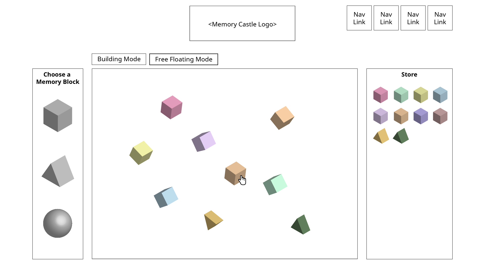
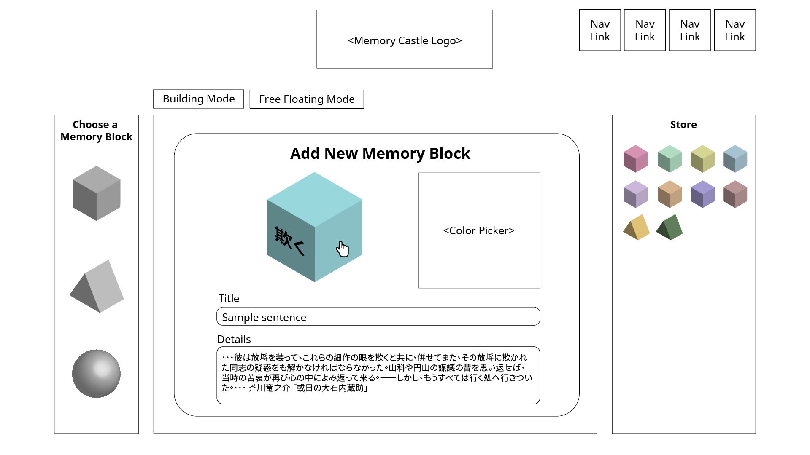

# memory-castle

## Background and Overview 

Memory Castle is a JavaScript application which creates and stores 3D memory building blocks in order to aid memorization. Users may view the blocks in an building mode or free-floating mode.

Memory Castle is inspired by the Method of Loci.

## Functionality and MVPs 

In Memory Castle, users will be able to:
- [ ] Choose between different 3D building blocks, and save title and details on different faces of the building blocks
- [ ] Reveal details on building blocks by clicking/dragging
- [ ] Build 3D structures with building blocks
- [ ] View free-floating building blocks

## Wireframes 
**Building Mode**

**Free-floating Mode**

**New Building Block**

## Architecture and Technology 

- `JavaScript`
- `three.js` for 3D visualization 

## Implementation Timeline 

### 2020/12/07
- Setup file structure
- Learn three.js

### 2020/12/08
Phase 1:
- Add modal for building block title and details
- Add basic styling

### 2020/12/09
Phase 2:
- Display building blocks in a store
- Reveal details when the respective face is dragged/clicked

### 2020/12/10
Phase 3:
- Drag building blocks from store and build structure
- Display building mode and free-floating mode

### 2020/12/11
- Finish styling
- Finish production README

## Bonus 
- Add background music with mute option